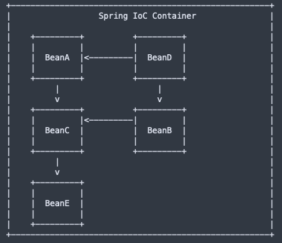

# Practical Spring Boot for TDP


## Dependency Injection in Spring


### Container

- The core of the Spring framework is the IoC (Inversion of Control) **Container**. <br/>
It creates the objects (**Beans**), configures and assembles their dependencies, and manages their entire life cycle.
- The Container uses Dependency Injection(DI) to manage the components that make up the application. <br/>
It gets information about the objects from the Java Code and Annotations.

### Bean
The managed object (instance) by Spring.
- Spring manages bean creation\destruction
- Spring manages bean dependencies (by injection)
- Spring manages bean scope (singleton or prototype)

### ApplicationContext

ApplicationContext is the _Spring_ interface representing the IoC container. ApplicationContext holds all beans and manages them.
To obtain a bean from ApplicationContext, use the getBean() function and specify bean ID or interface\class. In case of no ambiguity – _Spring_ will automatically know which bean to extract for you.

```java
ApplicationContext ctx = new AnnotationConfigApplicationContext(
				"com.att.course.spring.demo.components");

MyBean bean1 = ctx.getBean(MyBean.class);
MyBean bean2 = ctx.getBean("MyBean");
```



### Spring Beans Configuration: @Bean and @Component

An application should provide the bean configuration to the ApplicationContext container. <br/>
A Spring bean configuration consists of one or more beans definitions. <br/>
_Spring_ supports different ways of configuring beans:
- `@Bean` annotated methods within a `@Configuration` annotated class
- `@Component` annotated classes

#### `@Bean`-annotated methods within a `@Configuration` class

- A class annotated with `@Configuration` indicates that it contains Spring Bean configurations.
- The `@Bean` annotation on a method indicates that the method creates a Spring Bean.

```java
public class MyComponent {
	// the component code
}

@Configuration
public class ComponentsConfig {
	@Bean
	public MyComponent myComponent() { 
		return new MyComponent();
	}
}

ApplicationContext ctx = new AnnotationConfigApplicationContext(ComponentsConfig.class);
MyComponent comp = ctx.getBean(MyComponent.class);
```
#### `@Component`-annotated classes

- Mark a class by one from the Spring annotations: `@Component`, `@Controller`, `@Service`, and `@Repository`.
  - `@Controller`, `@Service` and `@Repository` are special types of `@Component` annotation.
- Spring will automatically detect these classes as beans.

```java
@Component
public class MyComponent {
	// the component code
}

ApplicationContext ctx = new AnnotationConfigApplicationContext("com.att.course.spring.demo.components");
MyComponent comp = ctx.getBean(MyComponent.class);
```

#### `@Bean` vs `@Component`

- `@Component` is a class-level annotation used to auto-detect and auto-configure beans using classpath scanning.
  There's an implicit one-to-one mapping between the annotated class and the bean (i.e., one bean per class).
- `@Bean` is a method-level annotation, it is used to explicitly declare a single bean.
  You can use it, for example, to wire components from 3rd-party libraries (you don't have the source code so you can't annotate its classes with `@Component`), so automatic configuration is not possible.

### The different type of injections: Constructor, Field, Setter

### Constructor Injection
```java
@Component
public class Component1 {
// the Component1 code
}

@Component
public class Component2 {

	private Component1 comp1;
	
	public Component2(Component1 comp1) {
		    	this.comp1 = comp1;
	}
}
```

### Field Injection

```java
@Component
public class Component1 {
	// the Component1 code
}

@Component
public class Component2 {
	@Autowired private Component1 component1;
	public Component2() {}
}
```

### Setter Injection

```java
@Component
public class Component1 {
	// the Component1 code
}

@Component
public class Component2 {
	private Component1 component1;
	
	@Autowired
	public void setComponent1(Component1 component1) {
		this.component1 = component1;
	}
}
```

| Injection Type   | When to Use                     | Pros                            | Cons                           |
|------------------|--------------------------------|--------------------------------|--------------------------------|
| **Constructor**  | Preferred for mandatory dependencies | Immutable, clear, testable       | Slightly more boilerplate       |
| **Field**        | Quick prototyping, simple cases | Less boilerplate                 | Hard to test, hidden dependencies |
| **Setter**       | Optional or changeable dependencies | Flexible, solves circular dependencies | Mutable, dependencies not enforced |

Best practice:
**Constructor injection** is highly recommended for most cases due to clarity, immutability, and better testability. Use setter injection only when you need optional dependencies or to resolve circular dependencies. Avoid field injection for production code.


### `@Autowired`

- Spring `@Autowired` annotation is used for automatic dependency injection. Using the annotation, we instruct Spring to inject the bean “auto-magically”.
The process of Spring bean injection is called autowiring.
- `@Autowired` is generally used for field and setter injection. It can also be used with a constructor, to denote to Spring that this is the constructor to use for bean creation. But classes with a single constructor can omit the `@Autowired` annotation.
- `@Autowired` on fields happens AFTER calling the constructor.
- `@Autowired` is by default required and will fail in the case cannot be fulfilled. Change it by adding `@Autowired(required = false)`

By default, Spring resolves @Autowired entries by type.

```java
@Configuration
public class ComponentsConfig {
    @Bean
    public Component getComponent() {
       return new Component();
	}
}
```

```java
@Component
public class Component { 
// …
}
```

```java
@Component
public class AnotherComponent {
	private Component comp;
	
    public AnotherComponent(Component comp) {
		this.comp = comp;
	}
}
```

#### Autowire Disambiguation
If more than one bean of the same type is available in the container, the framework will throw a fatal exception.
To resolve this conflict, we need to tell Spring explicitly which bean we want to inject.

##### Autowiring by @Qualifier

```java
public class Component extends BaseComponent {
  // some code
}

@Configuration
public class ComponentConfig {
  @Bean("component1")
  public BaseComponent component1() {
    return new Component(param1);
  }
  @Bean("component2")
  public BaseComponent component2() {
    return new Component(param2);
  }
}
```

```java
@Component
public class AnotherComponent {
	private BaseComponent comp1;
	private BaseComponent comp2;

	AnotherComponent(@Qualifier("component1") BaseComponent comp1, @Qualifier("component2") BaseComponent comp2) {
	  this.comp1 = comp1;
	  this.comp2 = comp2;
	}
}
```

##### Autowiring by Name

```java
public class MyComponent extends BaseComponent {
}

@Configuration
public class ComponentsConfig {
    @Bean("myComponent")
    public BaseComponent getMyComponent() {
 		return new MyComponent();
	}
}
```

```java
@Component("myComponent")
public class MyComponent extends BaseComponent {
    // some code
}
```

```java
@Component
public class AnotherComponent {
	private BaseComponent baseComponent;

    AnotherComponent(BaseComponent myComponent) {
		this.baseComponent = myComponent;
	}
}
```

### Bean Scanning and Registration

- Spring can automatically scan and register in the application context all your beans,
  such as configurations, controllers, services, and other components you define.
- Spring can also automatically create and register beans from the jars that are added to your application.

#### Bean Scanning and Registration – HOW ?

- Use the annotation `@ComponentScan` to automatically scan and register for all beans, defined under the current package and all sub-packages.
- Use the annotation `@EnableAutoConfiguration` to automatically create and register beans also from the jars that are added to your application.
- But even better – use the annotation `@SpringBootApplication`, which enables `@ComponentScan`, `@EnableAutoConfiguration`, and `@Configuration` annotations.
- Usually, these annotations are placed with the main application class (that’s why it is generally recommended to locate it in a root package above other classes).

## Creating a Spring Boot Application from Scratch (Todo App)

### Pre-requisites

- A working internet connection
  - Proxy settings configured on your machine
- Java 21 (check yourself: `java --version` should result with output)   
- Latest _Maven_ (check yourself: `mvn --version` should result with output)  
  - Configured with jFrog repository
- Latest _Intellij IDEA_
  - Proxy settings configured in IDE
- Postman
- Git

<br><br>

### Generate a _Spring Boot_ Project using _spring initializr_

- Go to https://start.spring.io/
- Add dependencies
  - Spring Web
  - Spring Data JPA
  - H2 Database
- Fill in the project metadata and generate

### Spring Boot Starters
- Spring Boot starters are built-in Spring dependency descriptors that make development easier and rapid.
- Spring Boot provides around 50+ starters, for various tasks and technologies. The official starters follow a naming convention spring-boot-starter-*, where * denotes application type.
- When starting the application, the starter will load all the relevant JARs (for example, if you entered to the pom.xml dependency to spring-boot-starter-web, Spring would load all jar required for creating RESTful service).


### Project structure
- Open the project in _Intellij IDEA_
- Review the project files structure
- Review pom.xml
  - Inspect dependencies
- Review `@SpringBootApplication`
  - From SpringApplication.run, the application will create the application context, that contains all the required Beans. 
  - In the case of using a Web starter, it will also create an instance of Tomcat web server.
```java
@SpringBootApplication
public class TodoAppApplication {
	public static void main(String[] args) {
		SpringApplication.run(TodoAppApplication.class, args);
	}
}
```

### Compile & Run
- Verify the application compiles and runs successfully
  - View logs in the console 
    - Note that application server (Tomcat) starts on port 8080
- Review application.yml and set the port to 8081. Restart the application and verify it starts on port 8081
```yaml
server:
  port: 8081
```

### Define TodoEntity
- Add dto package
  - Create TodoEntity (Long id, String title, String description, boolean isCompleted) - setters & getters
  - Annotate TodoEntity with `@Entity`

### Create TodoRepository

- Create dal package
    - Create TodoRepository:

```java
@Repository
public interface TodoRepository extends JpaRepository<TodoEntity, Long> {
}
```

### Configure Database
We will work with the _H2_ in-memory database for this project.
- Add the following yaml section to application.yml 
```yaml
spring:
  h2:
    console:
      enabled: true
  datasource:
    url: jdbc:h2:mem:testdb
    driver-class-name: org.h2.Driver
    username: tdp
    password: tdp
  jpa:
    hibernate:
      ddl-auto: update
```
- Run the application and access the _H2_ console at http://localhost:8081/h2-console
- Verify you have an empty TODO_ENTITY table

## Play with DI (git branch: 01-di)

`@Component` is a generic stereotype for any Spring-managed component.
`@Repository`, `@Service`, and `@Controller` are specializations of `@Component` for more specific use cases (in the persistence, service, and presentation layers, respectively).

- create a controllers package
  - create TodoController
- create a services package
  - create TodoService 
- TEMP - will be deleted after this section
  - add some temporary code to the controller to call the service
 ```java
// Add to TodoController:
@GetMapping("/hello")
public ResponseEntity<String> hello(@RequestParam String name) {
    String result = todoService.sayHello(name);
    return ResponseEntity.ok(result);
}
// Add to TodoService:     
  public String sayHello(String name) {
      return "Hello " + name;
  }

```
- Instruct Spring to manage instances of both TodoService and TodoController
- Instruct Spring to inject TodoService into TodoController (field injection)
- Remove `@Autowired` from class member dependency
  - Observe dependency is null
- Remove `@Service` from dependency class
  - Observe Spring Boot does not bootstrap successfully
- Finally, replace `@Autowired` with constructor injection


## Building our Controller layer and adding our BL (git branch: 02-bl)


### Request mappings
`@RequestMapping`, `@GetMapping`, `@PostMapping`, `@PutMapping`, `@DeleteMapping` map web requests to Spring Controller methods.

### Request Binding
- `@PathVariable` - Binds a URI template variable to a method parameter
- `@RequestParam` - Binds a query parameter to a method parameter
- `@RequestBody` - Binds the HTTP request body to a method parameter

### Response Handling
- `ResponseEntity` represents the whole HTTP response: status code, headers, and body. 
  - As a result, we can use it to fully configure the HTTP response. 
  - If we want to use it, we have to return it from the endpoint; Spring takes care of the rest.

<br><br>

- Create request models
  - Create CreateTodoRequest (String title, String description) - setters & getters
  - Create UpdateTodoRequest (String title, String description, Boolean isCompleted) - setters & getters 
- Add `@RequestMapping` to the controller class with the path "/api/todos"
- Add the following endpoints:

| Method Name | Http Verb | Endpoint        | Returns                              | Expected Status     |
|-------------|-----------|-----------------|--------------------------------------|---------------------|
| getTodos    | GET       | /api/todos      | ResponseEntity\<List\<TodoEntity\>\> | 200OK               |
| getTodo     | GET       | /api/todos/{id} | ResponseEntity\<TodoEntity\>         | 200OK, 404NOT_FOUND |
| createTodo  | POST      | /api/todos      | ResponseEntity\<TodoEntity\>         | 201CREATED          |
| updateTodo  | PUT       | /api/todos/{id} | ResponseEntity\<TodoEntity\>         | 200OK, 404NOT_FOUND |
| deleteTodo  | DELETE    | /api/todos/{id} | ResponseEntity\<Void\>               | 204NO_CONTENT       |

- At this phase, we return a TodoEntity from the service layer if exists, null otherwise. 
If a todo doesn't exist, we return 404.
- Finally, let's test the endpoints using Postman

## Adding error handling (git branch: 03-error-handling)

<br><br>

- First let's refactor our service layer to throw exceptions in case a todo is not found.
  - For that purpose, create an exceptions package and a custom exception class `TodoNotFoundException`

```java
public class TodoNotFoundException extends RuntimeException {
    public TodoNotFoundException(String message) {
        super(message);
    }
}
```


### `@ExceptionHandler`

`@ExceptionHandler` is a Spring annotation that provides a mechanism to treat exceptions thrown during execution of 
controller methods.

```java
public class FooController{
//...
@ExceptionHandler
public void handleException(CustomException ex) {
  // Serves as the entry point for handling the specified exception in this controller only
}
}
```
<br><br>

- Add an exception handler for TodoNotFoundException
  - Create an ErrorDto (String errorCode, String errorMessage) 
  - return a ResponseEntity\<ErrorDto\> with a 404 status code, where errorCode is 100 and errorMessage is the exception message


### `@ControllerAdvice`

The most common approach is to use `@ExceptionHandler` on methods of a `@ControllerAdvice` classes so that 
the Spring Boot exception handling will be applied globally for all application controllers (or to a subset of controllers, if specified).
`@ControllerAdvice` is an annotation in Spring and, as the name suggests, is “advice” for multiple controllers. 
It enables the application of a single `@ExceptionHandler` to multiple controllers. 
With this annotation, we can define how to treat such an exception in a single place, and the system will call this handler for thrown exceptions on classes covered by this `@ControllerAdvice`.

<br><br>

- Add a `@ControllerAdvice` class `RestExceptionHandler`
- Extend it from `ResponseEntityExceptionHandler`, as it already provides some basic handling of Spring MVC exceptions
- Move the `@ExceptionHandler` method from the controller to the `@ControllerAdvice` class
- Make sure that everything works as expected

- Add an endpoint which deliberately throws IllegalArgumentException
  - Observe what Spring Boot returns
- Add an exception handler for `IllegalArgumentException` which returns a ResponseEntity\<ErrorDto\> with a 400 status code, 
where errorCode is 101 and errorMessage is the exception message

## `@RestController`, `@ResponseBody`, `@ResponseStatus` and `@RestControllerAdvice` (git branch: 04-rest-controller)


`@RestController` is a specialized version of the controller.
It includes the `@Controller` and `@ResponseBody` annotations, and as a result, simplifies the controller implementation.

`@ResponseBody` is a Spring annotation that binds a method return value to the response body.
`@ResponseStatus` is a Spring annotation that marks a method or exception class with the status code and reason that should be returned.
`@RestControllerAdvice` is a specialization of `@ControllerAdvice` that is used to define `@ExceptionHandler` methods that apply to all `@RestController` classes.

<br><br>

- Refactor the controller to use `@RestController` & `@ResponseStatus`
- Refactor the `@ControllerAdvice` to use `@RestControllerAdvice` & `@ResponseStatus`
- Rerun the application and test the endpoints


## Adding validation (git branch: 05-validation)


Java Bean Validation is the de-facto standard for implementing validation logic in the Java ecosystem. 
It’s well integrated with Spring and Spring Boot.
Spring Boot’s Bean Validation support comes with the validation starter:

```xml
<dependency> 
    <groupId>org.springframework.boot</groupId> 
    <artifactId>spring-boot-starter-validation</artifactId> 
</dependency>
```

Very basically, Bean Validation works by defining constraints to the fields of a class by annotating them with 
certain annotations, for example:
`@NotNull`, `@Size`, `@Min`, `@Max`, `@NotEmpty`, `@NotBlank`, `@Pattern`, `@Positive`, `@PositiveOrZero`, `@Negative`, `@NegativeOrZero`, etc.

### @Validated and @Valid

The `@Validated` annotation is a class-level annotation that we can use to tell Spring to validate parameters that 
are passed into a method of the annotated class.

Adding the `@Valid` annotation on method parameters and fields tells Spring that we want a method parameter 
or field to be validated.

Using those annotations, we can validate a RestController user input.
There are three things we can validate for any incoming HTTP request: Request body, Path variables, Query parameters.


<br>

- Add _spring-boot-starter-validation_ dependency to pom.xml
- Add validation annotations to the CreateTodoRequest class
  - title should not be null or empty and also should have a min length of 3 and a max length of 100
  - description should not be null or empty and also should have a max length of 300
- Add validation annotations to the UpdateTodoRequest class
  - title should have a min length of 3 and a max length of 100
  - description should have a max length of 300
- Add validation for the POST/PUT requests so that both `CreateTodoRequest` and `UpdateTodoRequest` are validated
- Add validation for the id path variable so that it is a positive number
- Test endpoints using Postman and verify that validation works as expected

### Customizing the error response for validation errors

If a validation of request body fails, a MethodArgumentNotValidException will be triggered. 
By default, Spring will translate this exception to a HTTP status 400 (Bad Request).
We can customize the response by adding a custom exception handler.

- Add a custom exception handler for MethodArgumentNotValidException in the @RestControllerAdvice class like so:

```java
    @Override
    protected ResponseEntity<Object> handleMethodArgumentNotValid(MethodArgumentNotValidException ex,
                                                                  HttpHeaders headers,
                                                                  HttpStatusCode status,
                                                                  WebRequest request) {
        String message = buildMessage(ex);
        ErrorDto errorDto = new ErrorDto("102", message);
        return new ResponseEntity<>(errorDto, status);
    }

    private String buildMessage(MethodArgumentNotValidException ex) {
        BindingResult bindingResult = ex.getBindingResult();
        return bindingResult.getFieldErrors()
                .stream()
                .map(this::toMessage)
                .collect(joining(", "));
    }

    private String toMessage(FieldError error) {
        return "Field '%s.%s' %s".formatted(error.getObjectName(), error.getField(), error.getDefaultMessage());
    }
```
- Test endpoints using Postman and verify that validation works as expected

If a validation of path variables or request parameters fails, a ConstraintViolationException will be triggered. 
By default, Spring will translate it to a Http status 500 (Internal Server Error).
If we want to return a HTTP status 400 instead (which makes sense, since the client provided an invalid parameter, making it a bad request), 
we can add a custom exception handler.

- Add an exception handler for ConstraintViolationException:

```java
    @ExceptionHandler(ConstraintViolationException.class)
    @ResponseStatus(BAD_REQUEST)
    public ErrorDto handleConstraintViolationException(ConstraintViolationException ex) {
        return new ErrorDto("102",ex.getMessage());
    }

```

- Let's add two more exception handlers - one for DataAccessException (a DB exception) and one for a general exception:

```java
    @ExceptionHandler(DataAccessException.class)
    @ResponseStatus(INTERNAL_SERVER_ERROR)
    public ErrorDto handleDataAccessException(DataAccessException ex) {
        return new ErrorDto("103",ex.getMessage());
    }

    @ExceptionHandler(Exception.class)
    @ResponseStatus(INTERNAL_SERVER_ERROR)
    public ErrorDto handleGeneralException(Exception ex) {
        return new ErrorDto("105",ex.getMessage());
    }
```

## Configuration (git branch: 06-configuration)


There are different options to store or apply configuration in Spring Boot, including:
- application.properties or application.yml
- Environment variables
- Command-line arguments

Spring Boot loads all these properties, and they can be easily injected into a managed Bean.
Spring Boot loads the properties in a very particular order (read [here](https://docs.spring.io/spring-boot/reference/features/external-config.html)).

### @Value

`@Value` is a Spring annotation that allows us to inject values from properties files or environment variables into 
fields of a Spring Bean.


### @ConfigurationProperties

`@ConfigurationProperties` is a Spring annotation that binds the fields of a class to the properties defined in the 
application.properties or application.yml file.

Spring Boot supports relaxed binding while mapping properties using @ConfigurationProperties beans, 
so there is no need to be an exact match between property names and bean properties.
For example, app-name in the properties file can be mapped to appName in the bean class.

### @ConfigurationPropertiesScan

`@ConfigurationPropertiesScan` is a Spring annotation that tells Spring Boot to scan and register
`@ConfigurationProperties` classes as beans. 

### Environment

The `Environment` object is a Spring abstraction that represents the environment in which the current application is running.
It provides methods to access properties from the application.properties or application.yml file, 
as well as environment variables.

<br>

- Add a MetaController with a request mapping /api/meta
- Create the following yaml section:

```yaml
todo-app:
  version: 1.0.0
  title: Todo App
  description: Spring Boot based Todo App for TDP
```
- Create a new package config and add a TodoAppConfig class (String version, String title, String description) - setters and getters
- Add the `@ConfigurationProperties` annotation to the TodoAppConfig class (prefix = "todo-app")
- Add the `@ConfigurationPropertiesScan` annotation to the TodoAppApplication class
- Inject the TodoAppConfig into the MetaController and return it as a response for GET /api/meta
- Inject the todo-app.version property into the MetaController (use @Value) and return it as a response for GET /api/meta/version
- Inject the server.port property into the MetaController (use @Value) and return it as a response for GET /api/meta/port
- Inject the Environment object into the MetaController and return the JAVA_HOME environment variable as a response for GET /api/meta/java-home
- Inject the PATH environment variable into the MetaController (use @Value) and return it as a response for GET /api/meta/path
- Test the endpoints using Postman

## Touch-ups (git branch - 07-touch-ups)

### Adding Spring Actuator to the project

In essence, Actuator brings production-ready features to our application.
Monitoring our app, gathering metrics, and understanding traffic or the state of our database becomes trivial with this dependency.

In pom.xml add:
```xml
<dependency>
<groupId>org.springframework.boot</groupId>
<artifactId>spring-boot-starter-actuator</artifactId>
</dependency>
```

Going now to http://localhost:8081/actuator/health should result with: {"status":"UP"}
To get more info add the following section to the yaml:
```yaml
management:
  endpoint:
    health:
      show-details: always
```

### Adding Lombok to the project

Lombok is a library that helps to reduce boilerplate code in Java classes.
It provides a set of annotations that generate the code for us during compilation.
Read [here](https://projectlombok.org/features/) for more.

In pom.xml add:
```xml
        <dependency>
            <groupId>org.projectlombok</groupId>
            <artifactId>lombok</artifactId>
            <scope>provided</scope>
        </dependency>
```

- IDE: enable annotation processing
- Refactor TodoController and TodoService to use @RequiredArgsConstructor (remove ctors)
- Refactor TodoRequest, TodoEntity, ErrorDto, and TodoAppConfig to use @Data and @NoArgsConstructor (remove setters/getters)
  - add @AllArgsConstructor to ErrorDto
- Modify spring.datasource.username and spring.datasource.password values in application.yml 
to use the DB_USERNAME and DB_PASSWORD environment variables respectively
- Test your endpoints and make sure everything works as expected

## Testing (git branch: 08-testing)


_Spring Boot_ provides several utilities and annotations to help when testing your application.
Most developers use the spring-boot-starter-test “Starter”, which imports (in the test scope):
- _Spring Test_ & _Spring Boot Test_ - utilities and integration test support for Spring Boot applications.
- _Junit_ - the de-facto standard for unit testing Java applications.
- _AssertJ_ - a fluent assertion library.
- _Mockito_ - a Java mocking framework.
- _Hamcrest_ - a library of matcher objects
- a number of other useful testing libraries.

### @SpringBootTest

The `@SpringBootTest` annotation is useful when we need to bootstrap the entire Spring application container.
This annotation creates an application context and loads all beans of the application.
It means we can `@Autowire` any bean that's picked up by component scanning into our test.
@SpringBootTest starts the embedded server and creates a web environment.

### Testing With a Mock Environment

By default, `@SpringBootTest` does not start the server but instead sets up a mock environment for testing web endpoints.
With Spring, we can query our web endpoints using class MockMvc, as shown in the following example:

```java
@AutoConfigureMockMvc
@SpringBootTest
class SpringMicroserviceDemoApplicationTests {

    @Autowired
    MockMvc mockMvc;

   @Test
    void testWithMockMvc() throws Exception {
      var result = mockMvc.perform(get("/hello/index"))
        .andExpect(status().isOk())
        .andReturn()
        .getResponse()
        .getContentAsString();

     assertThat(result, is(equalTo("Hello, world")));

    }
}
```

Use annotation `@AutoConfigureMockMvc` for operations with MockMvc.

### Testing with @WebMvcTest

If you want to focus only on the web layer and not start a complete ApplicationContext, consider using `@WebMvcTest` instead.
`@WebMvcTest` auto-configures the Spring MVC infrastructure and limits scanned beans to `@Controller`-related beans.
So, if your controller has some dependency to other beans from your service layer, 
the test won't start until you either load that config yourself or provide a mock for it.

### @MockBean

Use `@MockBean` annotation to mock a bean object.
Often, `@WebMvcTest` is limited to a single controller and is used in combination with `@MockBean` 
to provide mock implementations for required dependencies.


## Extras

### Beans Scope
A scope of a Bean describes how many instances should the container manage.
There are 6 types of beans scope. The most popular are:
Singleton (default) – the bean’s instance is created exactly once, and the same instance will be injected and used whenever it is requested
Prototype – whenever an instance of a certain bean is requested – a new instance of it will be created

The last four scopes are only available in a web-aware application:
- Request – per Http call
- Session – per user session
- Application – per servlet context
- WebSocket - per web socket connection

To define a bean’s scope, we can use the `@Scope` annotation.

### @PostConstruct and @PreDestroy

#### @PostConstruct

Sometimes you may need access to the bean once it is fully created:
- Perform some logical validation and assertions
- Setup non-spring dependencies based on injectable beans
- Verify autowire decisions

How can you know when a bean is passed through the creation process?
In constructor – setters DI have not been set yet
In each setter – you can’t tell what is the status of other status

Solution - In the Bean class, annotate a method with `@PostConstruct` and Spring will call it 
just after the initialization of the Bean properties.

#### @PreDestroy

Similar to `@PostConstruct`, `@PreDestroy` can be added to a Bean class's method, 
and it will be called before Spring removes our bean from the application context.
Using `@PreDestroy`, you can supply a graceful shutdown for your bean.

### Lazy Initialization

By default, Spring’s container is created eagerly: it immediately aims to create all beans along with their relationships
Pros:
Fail fast: If there are any problems with wiring – they are discovered immediately when the app comes up
Performance: all beans are up and ready to use during the application lifecycle. No time will be spent for creating a bean as part of the runtime

For heavily created beans, and\or ones that are not sure to encounter during the application lifetime, Spring offers lazy bean creation.
If the bean is defined as Lazy, Spring will create it only when needed.

```java
@Component
@Lazy
public class MyLazyBean {
	//…
}

AnnotationConfigApplicationContext ctx = new 	AnnotationConfigApplicationContext();
MyLazyBean theBean = ctx.getBean(MyLazyBean.class);
```

Note:
- In case the bean is needed for another non-lazy bean – it will still be created eagerly
- Prototype beans are lazy by definition


#### Lazy initialization and @Autowired

```java
@Component
@Lazy
public class MyLazyBean {
  //…
}
@Component
public class AnotherBean {
  @Lazy
  @Autowired
  private MyLazyBean theLazyBean;

  public MyLazyBean getLazyBean() {
    return theLazyBean;
  }
}

AnotherBean anotherBean = ctx.getBean(AnotherBean.class);
anotherBean.getLazyBean();
```

## General guidelines
- Use DTOs to transfer data between layers (SoC)
- Use Lombok to reduce boilerplate code
- Prefer constructor injection over field injection (remember - you need not use `@Autowired`)
- Use Java Streams to manipulate collections
- More to explore
  - Spring AOP for cross-cutting concerns
  - `@Async` for asynchronous processing
  - `@Scheduled` for scheduled tasks
  - `@Transactional` for transaction management
  - Filters & Interceptors for request/response manipulation
- Use _ObjectMapper_ to serialize/deserialize objects to/from JSON
