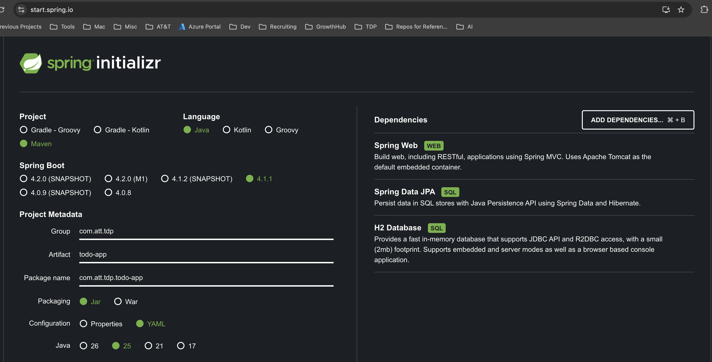

# Spring Boot based Todo app for TDP

## Generate a Spring Boot project using Maven Initializr
- Go to https://start.spring.io/
- Add dependencies
  - Spring Web
  - Spring Data JPA
  - H2 Database
- Fill in project metadata and generate



## Project structure
- Open project in Intellij IDE
- Review project files structure
- Review pom.xml
  - Inspect dependencies
- Review @SpringBootApplication
  - From SpringApplication.run, the application will create the application context, that contains all the required Beans. 
  - In the case of using a Web starter, it will also create an instance of Tomcat web server.
```java
@SpringBootApplication
public class TodoAppApplication {
	public static void main(String[] args) {
		SpringApplication.run(TodoAppApplication.class, args);
	}
}
```

## Compile & Run
- Verify the application compiles and runs successfully
  - View logs in the console
  - Note that application server (Tomcat) starts on port 8080
- Review application.yml and set the port to 8081
```yaml
server:
  port: 8081
```

- Add packages: dto, entity, controller, service, repository

  
## Define models and entities
- Create TodoRequest (String title, String description, Boolean completed)
- Create TodoEntity (Long id, String title, String description, Boolean completed)
  - Annotate the `id` property with `@Id` and `@GeneratedValue(strategy = GenerationType.IDENTITY)`, so JPA recognizes it as the primary key and delegates its generation to the database's identity column.
    - Make sure `@Id`, `@GeneratedValue`, and `GenerationType` are imported from the `jakarta.persistence` package.

## Create TodoRepository
```java
@Repository
public interface TodoRepository extends JpaRepository<TodoEntity, Long> {
}
```

## Configure Database
We will work with the H2 in-memory database for this project.
- Add the following yaml section to application.yml 
```yaml
spring:
  h2:
    console:
      enabled: true
  datasource:
    url: jdbc:h2:mem:testdb
    driver-class-name: org.h2.Driver
    username: tdp
    password: tdp
  jpa:
    hibernate:
      ddl-auto: update
```
- Run the application and access the H2 console at http://localhost:8081/h2-console
- Verify you have an empty TODO_ENTITY table

## Play with DI (git branch: 01-di)
- Create TodoController
- Create TodoService
- Instruct Spring to manage instances of both classes
- Instruct Spring to inject TodoService into TodoController
- Remove @Autowired from class member dependency
  - Observe dependency is null
- Remove @Service from dependency class
  - Observe Spring Boot does not bootstrap successfully
- Finally, replace @Autowired with constructor injection

## General guidelines
- Use DTOs to transfer data between layers (SoC)
- Use Lombok to reduce boilerplate code
- Prefer constructor injection over field injection (remember - you don't need @Autowired)
- Use Java Streams to manipulate collections
- More to explore
  - Spring AOP for cross-cutting concerns
  - @Async for asynchronous processing
  - @Scheduled for scheduled tasks
  - @Transactional for transaction management
  - Filters & Interceptors for request/response manipulation
- Use JsonMapper (Jackson 3) to serialize/deserialize objects to/from JSON

