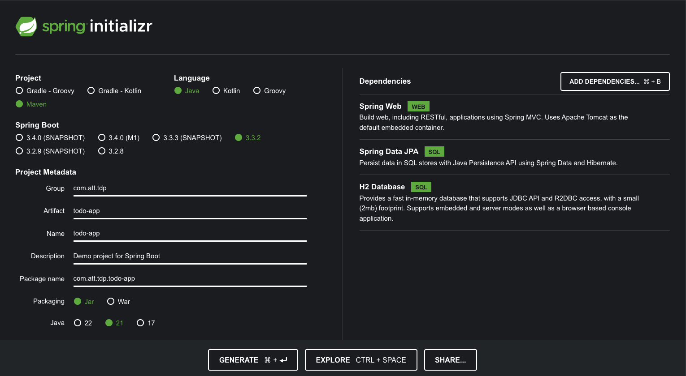

# Spring Boot based Todo app for TDP

## Generate a Spring Boot project using Maven Initializr
- Go to https://start.spring.io/
- Add dependencies
  - Spring Web
  - Spring Data JPA
  - H2 Database
- Fill in project metadata and generate



## Project structure
- Open project in Intellij IDE
- Review project files structure
- Review pom.xml
  - Inspect dependencies
- Review `@SpringBootApplication`
  - From SpringApplication.run, the application will create the application context, that contains all the required Beans. 
  - In the case of using a Web starter, it will also create an instance of Tomcat web server.
```java
@SpringBootApplication
public class TodoAppApplication {
	public static void main(String[] args) {
		SpringApplication.run(TodoAppApplication.class, args);
	}
}
```

## Compile & Run
- Verify the application compiles and runs successfully
  - View logs in the console
  - Note that application server (Tomcat) starts on port 8080
- Review application.yml and set the port to 8081
```yaml
server:
  port: 8081
```

- Add packages: dto, controllers, services, dal

  
## Define models and entities
- Create TodoRequest (String title, String description, Boolean isCompleted)
- Create TodoEntity (Long id, String title, String description, Boolean isCompleted)

## Create TodoRepository
```java
@Repository
public interface TodoRepository extends JpaRepository<TodoEntity, Long> {
}
```

## Configure Database
We will work with the H2 in-memory database for this project.
- Add the following yaml section to application.yml 
```yaml
spring:
  h2:
    console:
      enabled: true
  datasource:
    url: jdbc:h2:mem:testdb
    driver-class-name: org.h2.Driver
    username: tdp
    password: tdp
  jpa:
    hibernate:
      ddl-auto: update
```
- Run the application and access the H2 console at http://localhost:8081/h2-console
- Verify you have an empty TODO_ENTITY table

## Play with DI (git branch: 01-di)

`@Component` is a generic stereotype for any Spring-managed component.
`@Repository`, `@Service`, and `@Controller` are specializations of `@Component` for more specific use cases (in the persistence, service, and presentation layers, respectively).

- Create TodoController
- Create TodoService
- Instruct Spring to manage instances of both classes
- Instruct Spring to inject TodoService into TodoController
- Remove `@Autowired` from class member dependency
  - Observe dependency is null
- Remove `@Service` from dependency class
  - Observe Spring Boot does not bootstrap successfully
- Finally, replace `@Autowired` with constructor injection


## Building our Controller layer and adding our BL (git branch: 02-bl)

### Request mappings
`@RequestMapping`, `@GetMapping`, `@PostMapping`, `@PutMapping`, `@DeleteMapping` map web requests to Spring Controller methods.

### Request Binding
- `@PathVariable` - Binds a URI template variable to a method parameter
- `@RequestParam` - Binds a query parameter to a method parameter
- `@RequestBody` - Binds the HTTP request body to a method parameter

### Response Handling
- `ResponseEntity` represents the whole HTTP response: status code, headers, and body. 
  - As a result, we can use it to fully configure the HTTP response. 
  - If we want to use it, we have to return it from the endpoint; Spring takes care of the rest.

- Add `@RequestMapping` to the controller class with the path "/api/todos"
- Add the following endpoints:

| Method Name | Http Verb | Endpoint        | Returns                              |
|-------------|-----------|-----------------|--------------------------------------|
| getTodos    | GET       | /api/todos      | ResponseEntity\<List\<TodoEntity\>\> |
| getTodo     | GET       | /api/todos/{id} | ResponseEntity\<TodoEntity\>         |
| createTodo  | POST      | /api/todos      | ResponseEntity\<TodoEntity\>         |
| updateTodo  | PUT       | /api/todos/{id} | ResponseEntity\<TodoEntity\>         |
| deleteTodo  | DELETE    | /api/todos/{id} | ResponseEntity\<Void\>               |

- At this phase, we return an Optional<TodoEntity> from the service layer. 
If a todo doesn't exist, we return 404.
- Finally, let's test the endpoints using Postman

## Adding error handling (git branch: 03-error-handling)

- First let's refactor our service layer to throw exceptions in case a todo is not found.
  - For that purpose, create an exceptions package and a custom exception class `TodoNotFoundException`

### `@ExceptionHandler`

`@ExceptionHandler` is a Spring annotation that provides a mechanism to treat exceptions thrown during execution of 
controller methods.

```java
public class FooController{
//...
@ExceptionHandler
public void handleException(CustomException ex) {
  // Serves as the entry point for handling the specified exception in this controller only
}
}
```
- Add an exception handler for TodoNotFoundException
  - Create an ErrorDto (String errorCode, String errorMessage) 
  - return a ResponseEntity\<ErrorDto\> with a 404 status code, where errorCode is 100 and errorMessage is the exception message

### `@ControllerAdvice`

The most common approach is to use `@ExceptionHandler` on methods of a `@ControllerAdvice` classes so that 
the Spring Boot exception handling will be applied globally for all application controllers (or to a subset of controllers, if specified).
`@ControllerAdvice` is an annotation in Spring and, as the name suggests, is “advice” for multiple controllers. 
It enables the application of a single `@ExceptionHandler` to multiple controllers. 
With this annotation, we can define how to treat such an exception in a single place, and the system will call this handler for thrown exceptions on classes covered by this `@ControllerAdvice`.

- Add a `@ControllerAdvice` class `RestExceptionHandler`
- Extend it from `ResponseEntityExceptionHandler`, as it already provides some basic handling of Spring MVC exceptions
- Move the `@ExceptionHandler` method from the controller to the `@ControllerAdvice` class
- Make sure that everything works as expected

- Add an endpoint which deliberately throws IllegalArgumentException
  - Observe what Spring Boot returns
- Add an exception handler for `IllegalArgumentException` which returns a ResponseEntity\<ErrorDto\> with a 400 status code, 
where errorCode is 101 and errorMessage is the exception message

## `@RestController`, `@ResponseBody`, `@ResponseStatus` and `@RestControllerAdvice` (git branch: 04-rest-controller)

`@RestController` is a specialized version of the controller.
It includes the `@Controller` and `@ResponseBody` annotations, and as a result, simplifies the controller implementation.

`@ResponseBody` is a Spring annotation that binds a method return value to the response body.
`@ResponseStatus` is a Spring annotation that marks a method or exception class with the status code and reason that should be returned.
`@RestControllerAdvice` is a specialization of `@ControllerAdvice` that is used to define `@ExceptionHandler` methods that apply to all `@RestController` classes.

- Refactor the controller to use `@RestController` & `@ResponseStatus`
- Refactor the `@ControllerAdvice` to use `@RestControllerAdvice` & `@ResponseStatus`
- Rerun the application and test the endpoints

## General guidelines
- Use DTOs to transfer data between layers (SoC)
- Use Lombok to reduce boilerplate code
- Prefer constructor injection over field injection (remember - you don't need @Autowired)
- Use Java Streams to manipulate collections
- More to explore
  - Spring AOP for cross-cutting concerns
  - `@Async` for asynchronous processing
  - `@Scheduled` for scheduled tasks
  - `@Transactional` for transaction management
  - Filters & Interceptors for request/response manipulation
- Use ObjectMapper to serialize/deserialize objects to/from JSON
- 


